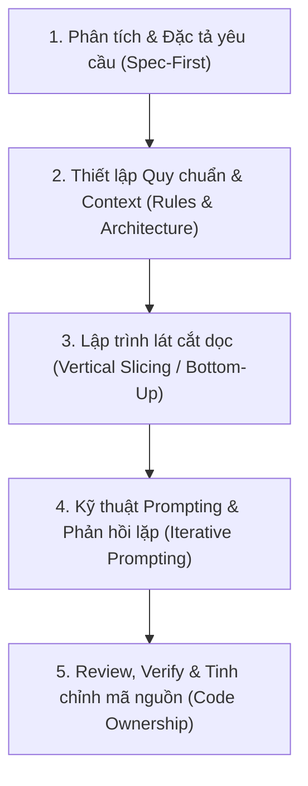
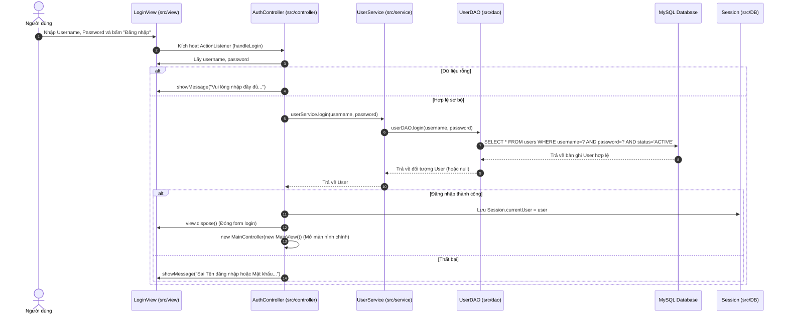
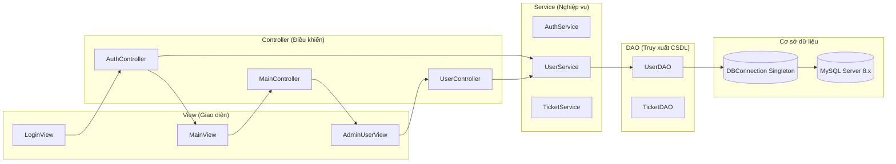
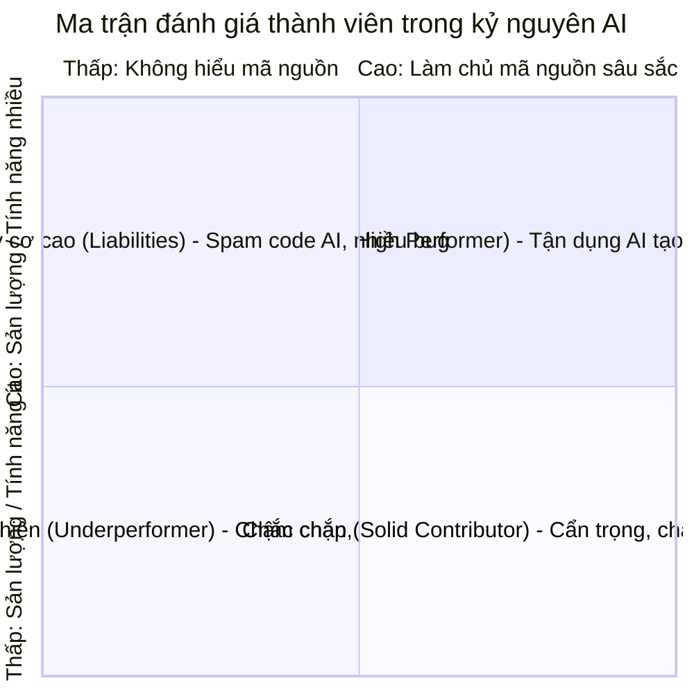
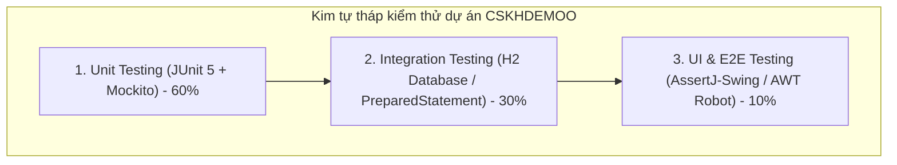

BÁO CÁO TIẾN ĐỘ DỰ ÁN VÀ CẨM NANG KIỂM SOÁT HỆ THỐNG VỚI AI AGENT

Học phần: Đồ án Xây dựng và Phát triển Phần mềm  
Sinh viên thực hiện: Nguyễn Tuấn Hưng  
Lớp: 74DCTT27  
Dự án thực tế: Hệ thống Chăm sóc và Xử lý Yêu cầu Khách hàng  
Công nghệ nền tảng: Java 17, Java Swing, JDBC thuần, MySQL 8.x, Mô hình đa tầng MVC  
Thời gian cập nhật: 04/11/2026  


MỤC LỤC CHI TIẾT
1. Ý 1: Phương pháp xây dựng hệ thống phần mềm với sự trợ giúp của AI Agent (Cursor, Copilot, Claude, Antigravity)
2. Ý 2: Kỹ năng kiểm soát mã nguồn dự án (Code Mastery & Leadership)
   - 2.1. Kiểm soát tính năng trong dự án Java Swing (Định vị code & sửa ràng buộc mật khẩu '@')
   - 2.2. Kỹ năng sử dụng Skill chuyên sâu: Graphify và hệ thống Agent Skills
   - 2.3. Ý hiểu về Log, Diff và góc nhìn Leader: Tiêu chí đánh giá thành viên làm việc hiệu quả
3. Ý 3: Kết hợp các công cụ kiểm thử tính năng nâng cao (Testing Strategy cho dự án CSKHDEMOO)


Ý 1: PHƯƠNG PHÁP XÂY DỰNG HỆ THỐNG VỚI SỰ TRỢ GIÚP CỦA AI AGENT

Ứng dụng AI Agent (GitHub Copilot, Cursor, Claude 3.5 Sonnet, Antigravity, OpenAI Codex...) trong phát triển phần mềm không đơn thuần là gõ prompt để sinh mã hàng loạt. Bản chất của kỹ sư phần mềm khi làm việc với Agent là đóng vai trò Tech Lead / Pair Programmer định hướng, còn Agent đóng vai trò Cộng sự lập trình tốc độ cao (Speed-up Junior Developer).



1.1. Bước 1: Đặc tả yêu cầu & Kiến trúc trước khi viết code (Spec-Driven Development)
- Sai lầm phổ biến: Yêu cầu Agent "Hãy viết cho tôi ứng dụng Quản lý CSKH đầy đủ chức năng bằng Java Swing". Kết quả: Code sinh ra bị dàn trải, lẫn lộn giữa UI và logic DB trong một file khổng lồ, thiếu xử lý ngoại lệ và không chạy được.
- Phương pháp đúng: 
  - Tự thiết kế sơ đồ cơ sở dữ liệu (Database Schema / DDL) gồm các bảng users, tickets, services.
  - Phân chia kiến trúc mô hình rõ ràng: MVC (Model - View - Controller) kết hợp DAO (Data Access Object) và Service (Business Layer).
  - Phân rã bài toán thành từng module độc lập: Xác thực (Auth), Quản lý tài khoản (UserManagement), Xử lý yêu cầu (TicketProcessing), Thống kê báo cáo (Statistics).

1.2. Bước 2: Thiết lập Context và Bộ quy tắc ứng xử cho Agent (Context Engineering)
- AI Agent thông minh nhất khi được cung cấp đúng ngữ cảnh dự án.
- Thiết lập file luật hoặc hướng dẫn hệ thống (như .cursorrules, SKILL.md, hoặc system prompt):
  - Khai báo công nghệ: Java 17, Swing UI (Flat styling), JDBC chuẩn (không dùng Hibernate/JPA), MySQL 8.x.
  - Quy tắc thiết kế: Không được viết câu lệnh SQL trong Controller hay View. Bắt buộc tách thành DAO. Mọi xử lý ràng buộc phải nằm ở tầng Service.
  - Quy ước đặt tên (Naming Convention): CamelCase cho hàm/biến, PascalCase cho tên Class, chuỗi tiếng Việt có dấu cho thông báo người dùng.

1.3. Bước 3: Lập trình lát cắt dọc và phát triển từ dưới lên (Bottom-Up Implementation)
Triển khai từng tính năng theo thứ tự phân tầng để đảm bảo tính chặt chẽ:
1. Model: Tạo lớp thực thể đại diện cho dữ liệu (User.java, Ticket.java).
2. Database & DAO: Viết lớp kết nối Singleton (DBConnection.java) và các thao tác CRUD an toàn với PreparedStatement (UserDAO.java).
3. Service Layer: Viết nghiệp vụ kiểm tra hợp lệ, bắt lỗi rỗng, độ dài mật khẩu, phân quyền (UserService.java).
4. View Layer: Thiết kế giao diện kế thừa JFrame / JDialog, thiết lập bố cục layout (LoginView.java).
5. Controller Layer: Lắng nghe sự kiện (ActionListener), kết nối View gọi Service và cập nhật trạng thái (AuthController.java).

1.4. Bước 4: Kỹ thuật Prompting chuyên sâu (Constraint & Context-Rich Prompting)
- Cung cấp ngữ cảnh cụ thể (Context Mention): Sử dụng tính năng @file (hoặc copy trích đoạn) để Agent thấy rõ cấu trúc các file liên quan trước khi sinh code mới.
- Kỹ thuật Few-Shot & Chain-of-Thought: Yêu cầu Agent giải thích các bước tư duy trước khi đưa ra code hoàn chỉnh.
- Áp dụng ràng buộc cứng (Hard Constraints):
  Ví dụ Prompt chuẩn:  
  "Tôi đang xây dựng hàm login trong UserDAO.java. Hãy sử dụng PreparedStatement để chống SQL Injection. Chỉ lấy các tài khoản có status = 'ACTIVE'. Đóng tài nguyên bằng cú pháp try-with-resources. Không dùng framework ORM."

1.5. Bước 5: Review, Kiểm soát chất lượng và Làm chủ mã nguồn (Verification)
- Tuyệt đối không copy-paste code của AI khi chưa đọc hiểu từng dòng.
- Kiểm tra các lỗi kinh điển mà AI thường mắc phải:
  - Quên đóng kết nối Connection, ResultSet, PreparedStatement gây rò rỉ tài nguyên (Resource Leak).
  - Tự động chế tên cột SQL không khớp với database thực tế (user_name thay vì username).
  - Vi phạm tính đóng gói (Encapsulation), xử lý logic nghiệp vụ ngay trên sự kiện click chuột của giao diện Swing.


Ý 2: KỸ NĂNG KIỂM SOÁT MÃ NGUỒN DỰ ÁN

2.1. Kiểm soát tính năng trong dự án CSKHDEMOO (Java Swing)

Khi Thầy cô hoặc Hội đồng bảo vệ đồ án đặt câu hỏi bất kỳ về mã nguồn, sinh viên phải nắm vững vị trí file, luồng tương tác (Call Flow) và cách sửa đổi trực tiếp.

A. Luồng chức năng Đăng nhập (Login Flow)



Vị trí chính xác các file mã nguồn liên quan đến Đăng nhập:
1. Giao diện tiếp nhận: src/view/LoginView.java
   - Chứa JTextField txtUsername, JPasswordField txtPassword, JButton btnLogin.
   - Cung cấp hàm getUsername(), getPassword(), addLoginListener(ActionListener l).
2. Bộ điều khiển xử lý sự kiện: src/controller/AuthController.java
   - Hàm initEvents() gắn lắng nghe cho nút đăng nhập.
   - Hàm handleLogin() thực hiện:
     ```java
     String username = view.getUsername();
     String password = view.getPassword();
     if (username.isEmpty() || password.isEmpty()) {
         view.showMessage("Vui lòng nhập đầy đủ Tên đăng nhập và Mật khẩu!");
         return;
     }
     User user = userService.login(username, password);
     if (user != null) {
         Session.currentUser = user; // Lưu thông tin người dùng phiên hiện tại
         view.dispose();
         new MainController(new MainView());
     } else {
         view.showMessage("Sai Tên đăng nhập hoặc Mật khẩu. Vui lòng thử lại!");
     }
     ```
3. Tầng dịch vụ nghiệp vụ: src/service/UserService.java và src/service/AuthService.java
   - Thực hiện kiểm tra null, trim khoảng trắng trước khi chuyển xuống DAO.
4. Tầng thao tác cơ sở dữ liệu: src/dao/UserDAO.java
   - Phương thức login(String username, String password):
     ```java
     String sql = "SELECT * FROM users WHERE username = ? AND password = ? AND status = 'ACTIVE'";
     try (Connection conn = DBConnection.getConnection(); 
          PreparedStatement ps = conn.prepareStatement(sql)) {
         ps.setString(1, username);
         ps.setString(2, password);
         try (ResultSet rs = ps.executeQuery()) {
             if (rs.next()) {
                 return new User(rs.getInt("id"), rs.getString("username"), 
                                 null, rs.getString("full_name"), 
                                 rs.getString("role"), rs.getString("status"));
             }
         }
     }
     ```
5. Lưu trữ trạng thái phiên làm việc: src/DB/Session.java
   - Biến toàn cục public static User currentUser dùng xuyên suốt để phân quyền (Admin, Supervisor, Employee).


B. Tình huống thực hành: Sửa tính năng tạo ràng buộc mật khẩu phải chứa ký tự @

Câu hỏi thực tế từ Giảng viên:  
"Em hãy chỉ ra đoạn code kiểm tra mật khẩu hợp lệ khi tạo mới hoặc đổi mật khẩu người dùng nằm ở đâu? Nếu thầy muốn đổi quy tắc: Mật khẩu tối thiểu 8 ký tự và BẮT BUỘC PHẢI CÓ KÝ TỰ @ thì sửa như thế nào?"

1. Vị trí mã nguồn cần can thiệp:
Mọi ràng buộc nghiệp vụ (Business Rules) bắt buộc phải nằm ở tầng Service, cụ thể là file src/service/UserService.java:
- Phương thức processAddUser(User u) (xử lý khi thêm mới nhân viên/quản trị viên).
- Phương thức processResetPassword(int userId, String newPass) (xử lý khi đặt lại mật khẩu).

2. Đoạn mã hiện tại trong dự án:
```java
// Dòng 41-43 tại src/service/UserService.java:
if (password.length() < 8 || !password.matches(".*[^a-zA-Z0-9].*")) {
    return "Mật khẩu phải dài tối thiểu 8 ký tự và có ít nhất một ký tự đặc biệt (!, @, #, $, %...).";
}
```

3. Cách sửa theo yêu cầu Bắt buộc có ký tự @:

Cách 1: Sử dụng phương thức chuỗi trực quan contains("@") (Đơn giản, dễ giải thích nhất)
```java
if (password.length() < 8 || !password.contains("@")) {
    return "Lỗi bảo mật: Mật khẩu phải dài tối thiểu 8 ký tự và bắt buộc phải chứa ký tự '@'!";
}
```

Cách 2: Sử dụng Biểu thức chính quy (Regular Expression - Regex chuyên nghiệp)
Nếu muốn mật khẩu vừa dài từ 8 ký tự, có chữ hoa, chữ thường, chữ số và bắt buộc chứa @:
```java
// Regex kiểm tra độ dài >= 8 và có chứa ít nhất 1 ký tự @
if (password.length() < 8 || !password.matches(".*@.*")) {
    return "Lỗi: Mật khẩu phải từ 8 ký tự trở lên và bắt buộc chứa ký tự '@'!";
}

// Regex nâng cao theo tiêu chuẩn bảo mật doanh nghiệp:
// - Ít nhất 1 chữ thường (?=.*[a-z])
// - Ít nhất 1 chữ hoa (?=.*[A-Z])
// - Ít nhất 1 chữ số (?=.*\\d)
// - Bắt buộc có ký tự @ (?=.*@)
// - Tổng độ dài tối thiểu 8 ký tự .{8,}
String passwordPattern = "^(?=.*[a-z])(?=.*[A-Z])(?=.*\\d)(?=.*@).{8,}$";
if (!password.matches(passwordPattern)) {
    return "Mật khẩu phải có ít nhất 8 ký tự, gồm cả chữ hoa, chữ thường, số và bắt buộc có ký tự '@'!";
}
```

4. Phân tích kiến trúc khi trả lời Thầy cô:
- Tại sao không viết ràng buộc này ở AdminUserView.java?  
  Giao diện chỉ nên kiểm tra rỗng cơ bản (format/empty check) để nâng cao trải nghiệm người dùng (UX). Nếu đặt toàn bộ luật nghiệp vụ ở giao diện sẽ vi phạm nguyên lý SRP (Single Responsibility Principle) và dễ bị vượt qua (bypass) nếu hệ thống tích hợp thêm giao diện khác (như Web/API sau này).
- Tại sao không viết ở UserDAO.java?  
  Tầng DAO chỉ có nhiệm vụ thuần túy là CRUD dữ liệu với Database. DAO không được chứa nghiệp vụ kinh doanh (Business Agnostic).


2.2. Kỹ năng sử dụng Skill chuyên sâu: Graphify và Agent Skills

A. Graphify Skill là gì và hỗ trợ viết code ra sao?
Graphify là kỹ năng phân tích và trực quan hóa cấu trúc dự án dưới dạng Đồ thị tri thức (Knowledge Graph) / Đồ thị phụ thuộc (Code Dependency & Call Graph).



Ứng dụng thực tế của Graphify khi lập trình cùng Agent:
1. Ngăn chặn lỗi dây chuyền (Impact Analysis): Khi sửa đổi cấu trúc bảng users hoặc phương thức trong UserDAO, Graphify cho Agent thấy ngay các lớp bị ảnh hưởng gián tiếp (UserService -> UserController -> AdminUserView), từ đó Agent chủ động sửa toàn bộ các điểm liên quan, tránh lỗi biên dịch (Compile error).
2. Loại bỏ phụ thuộc vòng (Circular Dependency): Giám sát mã nguồn để đảm bảo Controller không gọi ngược View một cách luẩn quẩn, View không bao giờ import DAO.
3. Tối ưu ngữ cảnh nạp vào Agent: Thay vì nạp toàn bộ mã nguồn của dự án (gây tràn context window hoặc làm AI bị ảo giác - hallucination), kỹ sư chỉ nạp đúng các node trong đồ thị mà tác vụ đang yêu cầu.

B. Các Skills và công cụ Agentic quan trọng khác phục vụ viết code:
1. Codebase AST / Symbol Navigation Skill (LSP - Language Server Protocol):
   Khả năng nhảy trực tiếp tới định nghĩa (Jump to Definition), tìm kiếm tất cả tham chiếu (Find All References). Giúp Agent đọc mã nguồn chính xác như một Compiler thực thụ.
2. Context & Rules Skill (.cursorrules / SKILL.md):
   Lưu trữ kiến thức dài hạn (Memory & Persistent Guidelines) về dự án: chuẩn mã hóa Tiếng Việt (UTF-8), cách xử lý ngày giờ (java.sql.Timestamp), cấu hình font chữ hiển thị tiếng Việt trên Java Swing (Segoe UI, 13pt).
3. Automated Terminal & Build Verification Skill:
   Kỹ năng cho phép Agent tự động chạy lệnh biên dịch javac hoặc ant compile, chạy bộ kiểm thử JUnit, đọc log lỗi trả về và tự sửa mã nguồn cho tới khi thành công mà không cần con người can thiệp thủ công từng bước.


2.3. Ý hiểu về công cụ Log, Diff và góc nhìn Leader: Đánh giá hiệu quả thành viên

A. Bản chất kỹ thuật của Log và Diff

1. Công cụ Log (Git Log & Runtime Log):
- Git Commit Log (git log --graph --oneline): Là biên niên sử ghi lại tiến trình tư duy và kết quả công việc của lập trình viên. Thể hiện tần suất làm việc, mức độ phân chia công việc nhỏ gọn (Atomic Commits), và cách diễn đạt có chuyên nghiệp hay không (Semantic Commits: feat, fix, refactor, test).
- Application Runtime Log (SLF4J, Log4j, Console Output): Ghi lại dòng chảy thực thi của phần mềm khi chạy thật. Giúp bắt lỗi NullPointerException, lỗi kết nối cơ sở dữ liệu SQLException, theo dõi thời gian phản hồi của câu truy vấn để phát hiện điểm nghẽn hiệu năng (bottleneck).

2. Công cụ Diff (Git Diff & Pull Request Diff):
- Bản chất: So sánh trực quan từng ký tự, từng dòng mã nguồn giữa hai thời điểm hoặc giữa hai nhánh (Feature Branch vs Main Branch).
- Ý nghĩa kiểm soát:
  - Phát hiện Code Bloat (code phình to bất thường do copy nguyên trang tài liệu từ AI).
  - Phát hiện Dead Code (code rác sinh ra nhưng không ai gọi).
  - Ngăn chặn Breaking Changes (xóa nhầm phương thức mà đồng đội khác đang phụ thuộc).


B. Đóng vai trò Leader: Làm sao để biết một thành viên làm việc hiệu quả hay không?

Cảnh báo từ Leader: "Số lượng dòng code (Lines of Code - LOC) hay số lượng commit KHÔNG PHẢI là thước đo hiệu quả!"  
Trong kỷ nguyên AI, một lập trình viên lười biếng có thể prompt ChatGPT sinh ra 2.000 dòng code trong 5 phút, commit 20 lần một ngày nhưng chứa đầy lỗ hổng bảo mật, không hiểu luồng chạy và làm hỏng cả hệ thống. Ngược lại, một lập trình viên giỏi chỉ cần sửa 3 dòng code để tối ưu triệt để câu truy vấn SQL hay vá một lỗi rò rỉ bộ nhớ nghiêm trọng.



Bảng tiêu chí toàn diện đánh giá hiệu quả thành viên nhóm (5 Tiêu chí cốt lõi):

| STT | Tiêu chí đánh giá | Cách đo lường qua Log, Diff và Thực tế | Đánh giá Hiệu quả (Good) | Đánh giá Kém hiệu quả (Bad) |
|:---:|:---|:---|:---|:---|
| 1 | Mức độ làm chủ mã nguồn (Code Ownership) | Phỏng vấn trực tiếp tại chỗ (Code Walkthrough) | Giải thích vanh vách từng dòng code, lý do chọn thuật toán, luồng dữ liệu đi qua những đâu. | Ngập ngừng, trả lời: "Đoạn này AI viết em thấy chạy được thì em dùng", không biết sửa khi có yêu cầu mới. |
| 2 | Chất lượng Diff (PR Quality & Clean Code) | Kiểm tra qua git diff trên Pull Request | Diff gọn gàng, đúng phạm vi tính năng. Không có code thừa, comment vô nghĩa hay hardcode mật khẩu. | Diff khổng lồ hàng nghìn dòng lẫn lộn định dạng, format lung tung, xóa nhầm code của người khác. |
| 3 | Kỷ luật Git (Git Hygiene & Traceability) | Kiểm tra qua git log | Commit đều đặn mỗi khi xong 1 đơn vị tính năng nhỏ; thông điệp commit rõ ràng (feat: add login validation). | Cả tuần không commit, đến sát hạn nộp dồn 1 commit duy nhất ghi update code hoặc fix all. |
| 4 | Tỷ lệ lỗi & Độ tin cậy (Defect Density) | Số lượng bug phát sinh khi Test / Review | Code chạy mượt mà ngay lần đầu, xử lý tốt các ngoại lệ biên (dữ liệu rỗng, chuỗi quá dài, ngắt kết nối DB). | Chạy thử là văng lỗi NullPointerException, bắt người khác phải sửa hộ lỗi cơ bản. |
| 5 | Giá trị bàn giao thực tế (Business Delivery) | Đối chiếu với Bảng yêu cầu chức năng (Spec) | Hoàn thành đúng hạn, đúng nghiệp vụ cam kết; giao diện thân thiện, dễ sử dụng. | Trễ hạn (Late delivery); tính năng làm thừa cái không cần thiết nhưng thiếu cái khách hàng yêu cầu. |

---

Ý 3: KẾT HỢP CÁC CÔNG CỤ KIỂM THỬ TÍNH NĂNG NÂNG CAO

Để đảm bảo hệ thống CSKH KeySoft vận hành bền bỉ, không bị lỗi hồi quy (Regression Bugs) khi bổ sung tính năng mới, nhóm phát triển áp dụng Kim tự tháp kiểm thử phần mềm (Testing Pyramid) với các công cụ nâng cao phù hợp với dự án Java:



3.1. Kiểm thử đơn vị (Unit Testing) với JUnit 5 và Mockito
- Mục tiêu: Kiểm thử độc lập logic nghiệp vụ tại tầng Service (UserService, TicketService) mà không phụ thuộc vào cơ sở dữ liệu thật.
- Kỹ thuật cô lập: Sử dụng Mockito để "giả lập" (mock) tầng UserDAO.

Mã nguồn kiểm thử mẫu cho quy tắc mật khẩu và tài khoản Admin:
```java
package test.service;

import static org.junit.jupiter.api.Assertions.*;
import static org.mockito.Mockito.*;

import dao.UserDAO;
import model.User;
import org.junit.jupiter.api.BeforeEach;
import org.junit.jupiter.api.DisplayName;
import org.junit.jupiter.api.Test;
import org.mockito.InjectMocks;
import org.mockito.Mock;
import org.mockito.MockitoAnnotations;
import service.UserService;

public class UserServiceTest {

    @Mock
    private UserDAO userDAO;

    @InjectMocks
    private UserService userService;

    @BeforeEach
    void setUp() {
        MockitoAnnotations.openMocks(this);
    }

    @Test
    @DisplayName("Kiểm tra thêm tài khoản thất bại khi mật khẩu thiếu ký tự đặc biệt / thiếu @")
    void testAddUser_InvalidPassword_ShouldFail() {
        User user = new User(0, "tuanhung", "hung123456", "Nguyễn Tuấn Hưng", "EMPLOYEE", "ACTIVE");
        
        String result = userService.processAddUser(user);
        
        assertTrue(result.contains("Mật khẩu phải dài tối thiểu 8 ký tự và có ít nhất một ký tự đặc biệt"));
        // Đảm bảo không bao giờ gọi xuống Database khi nghiệp vụ sai
        verify(userDAO, never()).addUser(any(User.class));
    }

    @Test
    @DisplayName("Kiểm tra thêm tài khoản thành công khi dữ liệu và mật khẩu chuẩn")
    void testAddUser_Valid_ShouldSuccess() {
        User user = new User(0, "tuanhung", "Hung@123456", "Nguyễn Tuấn Hưng", "EMPLOYEE", "ACTIVE");
        when(userDAO.isUsernameExist("tuanhung", -1)).thenReturn(false);
        when(userDAO.addUser(any(User.class))).thenReturn(true);

        String result = userService.processAddUser(user);

        assertEquals("", result, "Thêm người dùng hợp lệ phải trả về chuỗi rỗng (thành công)");
        verify(userDAO, times(1)).addUser(any(User.class));
    }

    @Test
    @DisplayName("Bảo vệ hệ thống: Ngăn chặn tuyệt đối việc xóa tài khoản ADMIN")
    void testDeleteUser_AdminAccount_ShouldPrevent() {
        User adminUser = new User(1, "admin", "Admin@123", "Quản Trị Viên", "ADMIN", "ACTIVE");
        when(userDAO.getUserById(1)).thenReturn(adminUser);

        String result = userService.processDeleteUser(1);

        assertTrue(result.contains("Cảnh báo vi phạm: Không thể vô hiệu hóa tài khoản của Quản trị viên (ADMIN)!"));
        verify(userDAO, never()).smartDeleteUser(1);
    }
}
```

---

3.2. Kiểm thử tích hợp (Integration Testing) với Cơ sở dữ liệu mẫu
- Mục tiêu: Kiểm tra các câu truy vấn phức tạp của UserDAO và TicketDAO (tìm kiếm kết hợp phân trang LIMIT ... OFFSET, tính toán thống kê) với cơ sở dữ liệu MySQL test hoặc CSDL bộ nhớ trong H2.
- Quy trình:
  1. Tạo schema database và nạp dữ liệu mẫu (Fixtures/Seeds).
  2. Thực thi DAO và so sánh kết quả trả về với dữ liệu mong đợi.
  3. Tự động Rollback sau mỗi test case để không làm bẩn dữ liệu.

---

3.3. Kiểm thử giao diện người dùng tự động (UI Automation Testing với AssertJ-Swing)
- Vấn đề của Java Swing: Thường bị kiểm thử thủ công bằng tay (bấm click từng nút rất tốn thời gian và dễ sót trường hợp).
- Giải pháp nâng cao: Sử dụng thư viện AssertJ-Swing (hoặc AWT Robot) để giả lập thao tác chuột và bàn phím:
  ```java
  @Test
  void testLoginUI_SuccessFlow() {
      // 1. Khởi chạy giao diện LoginView
      LoginView view = GuiActionRunner.execute(() -> new LoginView());
      FrameFixture window = new FrameFixture(view);
      window.show();

      // 2. Tự động nhập thông tin vào các trường text
      window.textBox("txtUsername").enterText("admin");
      window.textBox("txtPassword").enterText("Admin@123");

      // 3. Tự động bấm nút Đăng nhập
      window.button("btnLogin").click();

      // 4. Kiểm tra cửa sổ Login đã đóng và màn hình chính xuất hiện
      window.requireNotVisible();
      window.cleanUp();
  }
  ```

---

3.4. Tự động hóa kiểm thử liên tục (CI/CD Pipeline với GitHub Actions)
Tích hợp kiểm thử vào quy trình làm việc nhóm thông qua file workflow .github/workflows/test.yml:
- Mỗi khi thành viên đẩy code (git push) hoặc tạo yêu cầu gộp nhánh (Pull Request):
  1. GitHub Actions tự động dựng môi trường JDK 17.
  2. Tự động chạy toàn bộ Test Suite với lệnh: mvn test hoặc ant test.
  3. Nếu có bất kỳ test case nào thất bại, hệ thống sẽ khóa nút Merge, ngăn chặn việc đưa code lỗi vào nhánh chính (main).

